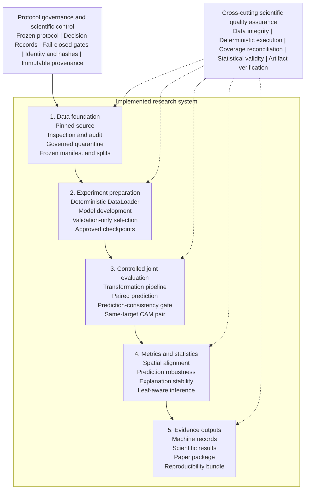

# PlantXAI-Stability

*System Architecture, Workflow, Pipeline, and Design Specification*

| Field | Value |
| --- | --- |
| Document ID | PXAI-ARCH-001 |
| Version | 1.0 |
| Status | Current implementation baseline |
| Date | 24 July 2026 |
| System | PlantXAI-Stability research software |
| Scope | Controlled prediction robustness and XAI explanation stability |
| Authority | Frozen protocol v0.9 and approved Decision Records |

> **Note:** Design intent: This document describes the implemented system. It is not a speculative future-state design and does not replace the frozen scientific protocol or its Decision Records.

Frozen data -> validation-selected models -> authorized test campaign -> paired prediction and XAI evidence -> read-only reporting

## Document Purpose and Scope

PlantXAI-Stability is reproducible research software for evaluating how controlled image transformations affect classification predictions and post-hoc visual explanations. The implementation combines deterministic data identity, fail-closed governance, two convolutional backbones, three CAM methods, paired robustness records, leaf-aware statistics, and cryptographically bound reporting artifacts.

This architecture specification documents component responsibilities, interfaces, execution workflows, data contracts, security and integrity boundaries, persistence behavior, failure recovery, and operational constraints. Dataset creation history is included for system completeness; routine reproduction may consume the already prepared frozen dataset without repeating preprocessing.

### Intended Audience

- Researchers reproducing the experiment in Colab or a local GPU environment.

- Maintainers reviewing module boundaries, runtime invariants, and artifact lineage.

- Project owners approving G0B, G1, G2, recovery, analysis, and reporting gates.

- Auditors validating that test pixels, checkpoint selection, and result reporting remain separated.

### Normative Sources

| Source | Role in the design |
| --- | --- |
| `configs/protocol/v0.9/protocol.yaml` | Frozen scientific configuration and runtime policy. |
| `configs/protocol/v0.9/decision_records/` | Human approvals and evidence-bound governance transitions. |
| `src/plantxai_stability/` | Reusable implementation modules and fail-closed validators. |
| `scripts/` | Operational entry points for audit, train, evaluate, merge, analyze, and report. |
| `tests/` | Unit, integration, and scientific invariant verification. |
| [`docs/colab_workflow.md`](docs/colab_workflow.md) | Detailed operational command sequence and storage conventions. |

## Contents

1. Architecture drivers and system context

1. Logical architecture and module catalog

1. Data, model, transformation, XAI, and analysis design

1. End-to-end workflows and runtime pipelines

1. Data contracts, artifacts, integrity, and governance

1. Deployment, failure handling, quality attributes, and verification

1. Operational script map and design constraints

## 1. Architecture Drivers

### 1.1 Scientific Goals

- RQ1: quantify prediction robustness under deterministic rotation, brightness, Gaussian noise, and Gaussian blur.

- RQ2: quantify explanation stability for Grad-CAM, Grad-CAM++, and Score-CAM under the same scenarios.

- RQ3: explore associations between prediction confidence changes and explanation stability without converting them into confirmatory tests.

- Preserve leaf-level biological grouping so uncertainty and paired inference do not treat correlated samples as independent.

### 1.2 Design Principles

| Principle | Architectural implication |
| --- | --- |
| Fail closed | Missing approval, hash mismatch, incomplete coverage, or ambiguous identity terminates the run before protected data are used. |
| Immutable identity | Samples, manifests, checkpoints, scenarios, results, and reports are identified by stable keys and SHA-256 evidence. |
| Validation before test | Checkpoint selection and validation audit are completed without official-test pixel access. |
| Deterministic execution | Seed derivation, DataLoader order, transformations, training settings, and resume state are explicit. |
| Paired evidence | Original and transformed observations share sample, model, scenario, target-class, and method identities. |
| Explicit exclusions | Invalid or non-comparable XAI records are retained with reason codes rather than silently dropped. |
| Separation of concerns | Data preparation, training, authorization, evaluation, analysis, and reporting are distinct stages. |
| Read-only reporting | Publication tables and figures are generated only from the frozen statistical-analysis artifacts. |

### 1.3 Quality Attributes

- Reproducibility: deterministic seeds, pinned source revision, immutable manifests, and environment capture.

- Auditability: machine-readable records, child artifact hashes, Decision Records, and explicit acceptance criteria.

- Integrity: canonical RGB hashing, lineage reconciliation, exact split coverage, and fail-closed authorization.

- Resumability: atomic epoch checkpoints and transactional per-sample joint evaluation.

- Portability: Python package APIs and CLI runners support local, Colab GPU, and CPU-only analysis environments.

- Scientific validity: leaf-aware resampling, predeclared comparisons, paired keys, and Holm correction.

## 2. System Context

The system sits between a pinned PlantVillage data source and an external research reporting environment. Its trust boundary includes the repository code, frozen protocol, Decision Records, prepared image store, frozen manifest, approved checkpoints, and immutable run outputs. Google Drive or equivalent object storage provides durable storage for Colab execution but is not the authority for scientific identity; content hashes are.

*Figure 1. Implemented architecture and cross-cutting scientific controls.*

### 2.1 External Actors and Systems

| Actor or system | Responsibility | Trust condition |
| --- | --- | --- |
| Project owner | Approves Decision Records and claim boundaries. | Approval must bind exact evidence hashes. |
| Research operator | Runs scripts in the declared order and preserves outputs. | Must not tune from official-test observations. |
| Hugging Face / source archive | Supplies the pinned PlantVillage revision and source metadata. | Revision and source evidence must match the protocol. |
| GPU runtime | Executes training, baseline inference, and CAM generation. | Runtime identity and deterministic settings are recorded. |
| Durable storage | Persists checkpoints, SQLite progress, merged results, and reports. | Files are validated by hashes, not path alone. |
| Reporting workspace | Consumes frozen analysis CSV/JSON to produce publication artifacts. | No pixels, checkpoints, predictions, or tests may be recomputed. |

## 3. Logical Architecture

The codebase follows a layered architecture. Lower layers establish identity and deterministic data access. Middle layers implement models, transformations, inference, CAM generation, and transactional execution. Upper layers enforce governance, analysis authorization, statistical inference, recovery, and reporting.

| Layer | Primary modules | Responsibility |
| --- | --- | --- |
| Configuration and governance | config, governance, g2_readiness, test_authorization | Resolve protocol identity and authorize protected transitions. |
| Data foundation | data.manifest, audit, leaf_identity, quarantine, freeze, splits, loader | Create and verify sample identity, eligibility, split safety, and deterministic batches. |
| Model execution | models, training, inference, transformations | Train/load backbones and generate paired prediction records. |
| XAI and metrics | xai, evaluation, statistics | Generate same-target CAMs, align support, compute stability metrics, and create joint records. |
| Transactional orchestration | joint_execution, artifacts, provenance | Bind run identity, resume safely, reconcile coverage, and index artifacts. |
| Official analysis | analysis_support, official_analysis | Preflight support, aggregate leaf-level evidence, test registered contrasts, and correct families. |
| Recovery and reporting | recovery, result_reporting | Bridge physical storage recovery and create read-only publication outputs. |

### 3.1 Core Domain Contracts

| Contract | Key fields | Invariant |
| --- | --- | --- |
| SampleRecord | sample_id, leaf_id, class, split, path, RGB hash, dimensions | One stable identity maps to one verified image and one frozen split. |
| PredictionRecord | sample_id, model_id, run_id, scenario_id, class, confidence, checkpoint hash | Prediction identity is traceable to model, checkpoint, scenario, and sample. |
| TransformationRecord | sample_id, scenario_id, transformation, severity, seed, parameters | Exact deterministic parameters are recorded for every transformed input. |
| JointRecord | sample, scenario, model, method, target class, metrics, exclusion reason | Metrics exist only for valid paired evidence; otherwise an explicit exclusion is retained. |
| RunContext | run_id, protocol version/hash, config hash, seed, timestamp | Every artifact tree has a machine-readable execution identity. |

## 4. Module Catalog

| Module | Responsibility |
| --- | --- |
| `config.py` | Protocol loader, canonical JSON hashing, schema-level fail-closed checks. |
| `contracts.py` | Immutable domain records shared across data, prediction, transformation, and joint evaluation. |
| `provenance.py` / `artifacts.py` | SHA-256 utilities, run context, atomic JSON, artifact manifests and indexes. |
| data/manifest.py | Canonical RGB hashes, stable sample IDs, manifest serialization and inspection. |
| data/audit.py | Duplicate, conflict, label, leaf, and image-level audit evidence. |
| data/leaf_identity.py | Leaf identity resolution coverage, collision, ambiguity, and split-overlap gates. |
| data/quarantine.py | Governed source-train overlap and exact-duplicate adjudication. |
| data/splits.py / `freeze.py` | Leaf-safe train/validation construction, split validation, and immutable freeze artifacts. |
| data/loader.py | Verified image decoding, normalization, identity-preserving Dataset, deterministic DataLoader. |
| `models.py` | ResNet50 and EfficientNet-B0 wrappers, target-layer access, checkpoint evidence. |
| `training.py` | Deterministic fine-tuning, validation macro-F1 selection, atomic latest/best checkpoints, resume. |
| `checkpoint_audit.py` | Validation-only classification metrics, probability records, and training-evidence validation. |
| `transformations.py` | Shared-randomization rotation, brightness, noise, blur, and geometric validity metadata. |
| `inference.py` / `evaluation.py` | Model inference, paired prediction records, exclusions, and joint-record construction. |
| `xai.py` | CAM lifecycle, heatmap quality, forward alignment, valid-region handling. |
| `statistics.py` | Heatmap metrics, leaf bootstrap, paired Wilcoxon, rank-biserial effect, Holm adjustment. |
| `joint_execution.py` | Canonical run identity, SQLite progress, atomic per-sample transactions, coverage checks. |
| `governance.py` / `test_authorization.py` | Approved checkpoint lineage and full G2 authorization before test pixels. |
| `g2_readiness.py` | Metadata-only reconciliation of G1 audit evidence and test identities. |
| `recovery.py` | Physical-freeze recovery validation and approved legacy-result preservation. |
| `analysis_support.py` | Metadata-only support counts and exclusion audit for all planned contrasts. |
| `official_analysis.py` | Merged-result validation, bootstrap summaries, paired contrasts, RQ3 associations. |
| `result_reporting.py` | Frozen result validation, eight tables, six figures, and structured summaries. |
| `cli.py` | Safe protocol-validation and scenario-smoke commands. |

## 5. Data Architecture

### 5.1 Source and Scope

The governed source is mohanty/PlantVillage, configuration color, pinned to revision 9e97599868962bd0079b8db4b7f1efa9185fa1e7. The study scope contains five Tomato classes. The system preserves source split membership and biological leaf identity while deriving a canonical RGB hash for every materialized image.

| Frozen population | Count | Design meaning |
| --- | --- | --- |
| Eligible samples | 8,384 | Single reconciled modeling population after governed exclusions. |
| Train | 5,328 | Used for parameter optimization only. |
| Validation | 1,363 | Used for checkpoint selection and G1 audit. |
| Official test | 1,693 | Preserved exactly and inaccessible before G2. |
| Quarantined train | 14 | Five source-train leaf overlaps plus nine redundant exact duplicates. |

### 5.2 Identity and Integrity Chain

1. Resolve source filename, class, split, source row, and leaf identity.

1. Decode the image to canonical RGB and compute pixel SHA-256 plus dimensions.

1. Construct sample_id from canonical relative path and canonical RGB hash.

1. Retain every selected row in lineage evidence and apply only approved quarantine decisions.

1. Validate that sample IDs and leaf IDs do not cross frozen splits.

1. Write `dataset_manifest.csv`/parquet, split CSVs, leakage report, summary, and freeze record.

1. At runtime, re-open each requested image and verify path, dimensions, RGB hash, range, split, and identity metadata.

> **Note:** Runtime rule: Training and evaluation consume the frozen manifest. Directory scanning, row-index identity, and ad-hoc resplitting are prohibited.

### 5.3 DataLoader Boundary

PlantDataset returns both a normalized model tensor and identity metadata. Image-domain transformations operate on RGB float pixels before ImageNet normalization. The DataLoader uses a seeded generator and seeded workers, does not shuffle validation/test, and preserves exact sample ordering where coverage reconciliation requires it.

## 6. Model and Training Architecture

| Backbone | Initialization | Classifier | CAM target |
| --- | --- | --- | --- |
| ResNet50 | IMAGENET1K_V2 | Five-class replacement head | layer4[-1] |
| EfficientNet-B0 | IMAGENET1K_V1 | Five-class replacement head | features[-1] |

### 6.1 Training Policy

- Full-model fine-tuning with cross-entropy, AdamW, weight decay 0.0001, and cosine scheduling.

- Batch size 32, maximum 50 epochs, validation macro-F1 selection, and patience 8.

- Seed 42, deterministic algorithms, deterministic cuDNN behavior, and mixed precision on CUDA.

- No class weighting and no official-test loader accepted by the training API.

- Atomic latest training state and best validation-selected checkpoint at each completed epoch.

### 6.2 Resume Contract

A resumable checkpoint stores model, optimizer, scheduler, GradScaler, epoch, best score, stale-epoch count, history, CPU/CUDA/NumPy/Python RNG state, and DataLoader generator state. Resume verifies model ID, class count, protocol hash, manifest hash, and the complete training configuration. Any mismatch blocks continuation.

### 6.3 Validation Audit and G1

The validation audit loads only validation pixels, reproduces the selected macro-F1, verifies exact identity coverage, and writes per-sample probabilities, per-class precision/recall/F1, confusion matrix, NLL, Brier score, and artifact hashes. G1 approval registers both checkpoints without using official-test outcomes.

## 7. Transformation Architecture

TransformationPipeline implements four deterministic image-domain operators at mild, moderate, and severe levels, producing twelve scenarios. A seed is derived from the global seed, sample identity, and transformation family. Shared randomization keeps rotation/brightness direction and the Gaussian base-noise field consistent across severity levels for the same sample.

| Transformation | Mild | Moderate | Severe | Key policy |
| --- | --- | --- | --- | --- |
| Rotation | 10 deg | 25 deg | 45 deg | Bilinear, constant-zero fill, geometric valid-region mask. |
| Brightness | 0.10 | 0.30 | 0.50 | Shared sign/direction across severity. |
| Gaussian noise | sigma 0.01 | sigma 0.05 | sigma 0.10 | Shared deterministic base-noise field. |
| Gaussian blur | 3 / 0.8 | 5 / 1.5 | 9 / 3.0 | Kernel size / sigma, deterministic OpenCV operator. |

> **Note:** Rotation claim boundary: Prediction robustness is specific to the declared zero-filled rotation operator. Explanation comparisons forward-align the original CAM and exclude invalid geometric support M_T.

## 8. Prediction and XAI Architecture

### 8.1 Paired Prediction

For each authorized test sample, the runner caches original inference and evaluates all twelve transformed scenarios. Each transformed prediction is paired with the original using the same sample, model, checkpoint, run, and scenario identity. RQ1 records correctness, prediction consistency, confidence, confidence drop, and related descriptive fields.

### 8.2 Same-Target CAM Generation

Grad-CAM, Grad-CAM++, and Score-CAM are generated for the original predicted class. The same target class is held fixed for the transformed image. Original CAMs are cached once per method, normalized through a heatmap quality gate, and paired only when prediction consistency and heatmap quality requirements pass.

### 8.3 Spatial Alignment and Metrics

| Metric | Role | Validity rule |
| --- | --- | --- |
| Pearson | Primary spatial association of heatmap intensity. | Computed on valid support; NaN heatmaps are excluded. |
| Masked SSIM | Primary structural similarity. | Uses declared window and geometric valid-region mask. |
| Top-20% IoU | Primary salient-region overlap. | Thresholded independently on valid support. |
| Top-10% / Top-30% IoU | Sensitivity analysis. | Same alignment and masking as primary IoU. |
| Cosine similarity | Secondary global similarity. | Reported descriptively for valid pairs. |

An invalid pair is not removed from the result population. A JointRecord is written with the exact exclusion reason, allowing downstream reconciliation of valid metrics, exclusions, and complete factorial coverage.

## 9. Transactional Joint Evaluation

The official joint campaign is partitioned into six model-method parts. JointProgressStore persists each part in SQLite and commits one complete sample transaction containing all twelve scenarios. The run identity binds protocol, checkpoint, manifest, code, scenarios, XAI method, alignment policy, and recovery lineage where applicable.

1. Validate G2 authorization and exact official-test identities before decoding a test image.

1. Create or validate the immutable run identity and SQLite progress store.

1. Skip already committed sample IDs; never selectively rerun based on observed metrics.

1. Compute original prediction and original method-specific CAM once for the sample.

1. Evaluate twelve transformations and write prediction plus joint records in one transaction.

1. On completion, materialize CSV outputs, validate exact coverage, write the report, and mark run_state complete.

1. Merge the three method parts per model only after prediction rows agree exactly across parts.

| Merged model output | Expected rows | Meaning |
| --- | --- | --- |
| `prediction_results.csv` | 20,316 | 1,693 samples x 12 scenarios. |
| `joint_results.csv` | 60,948 | 1,693 samples x 12 scenarios x 3 CAM methods. |
| `joint_merge_report.json` | 1 report | Lineage, child hashes, coverage, exclusions, acceptance criteria. |

## 10. Governance and Authorization Architecture

| Gate | Purpose | Protected boundary |
| --- | --- | --- |
| G0A | Bootstrap readiness and unresolved scientific decisions. | No official experiment while blockers remain. |
| G0B | Freeze protocol, severities, data lineage, and official training authorization. | Training requires matching protocol and freeze hashes. |
| G1 | Approve validation-selected checkpoints and validation-audit evidence. | No official-test access or model ranking from test. |
| G2 | Authorize one registered official-test campaign. | Every runner recomputes the full chain before test-pixel access. |
| Analysis | Bind exact model merge reports and predeclare inference. | No image access, retuning, endpoint changes, or selective exclusions. |
| Results freeze | Bind the official analysis report and six child CSVs. | Reporting is read-only and cannot recompute predictions, CAMs, or tests. |

### 10.1 Metadata-Only G2 Readiness

The readiness stage hashes checkpoints, training evidence, validation audits, the frozen manifest, split summary, and official-test sample/leaf identity lists. It does not construct a test Dataset, decode a test image, execute inference, or calculate a test metric. Human approval then creates the test Decision Record for the registered campaign.

### 10.2 Runtime Authorization

authorize_official_test_run validates current governance state, protocol hash, checkpoint registry, checkpoint bytes, readiness-report hash, manifest and freeze lineage, source test membership, sample and leaf identity hashes, declared models, scenarios, methods, and execution policy. Only after every comparison passes are test SampleRecords returned to the caller.

## 11. Statistical Analysis Architecture

### 11.1 Support Preflight

The support audit reads only identity and exclusion columns from the merged results. It enumerates all 192 planned support contrasts without reading endpoint metric values or computing hypothesis tests. The registered 20-leaf minimum remains fixed.

### 11.2 Official Analysis

- Requires exact ResNet50 and EfficientNet-B0 merge report hashes and child artifacts.

- Validates complete prediction and joint factorial coverage before summary computation.

- Uses 10,000 deterministic leaf-cluster bootstrap replicates for confidence intervals.

- Intersects paired sample identities before arithmetic aggregation to leaf means.

- Applies two-sided paired Wilcoxon tests with Pratt zero handling and rank-biserial effect size.

- Applies only the predeclared Holm families; no post-result family redesign is permitted.

- Retains three insufficient-support endpoints as non-estimable, with empty inferential fields.

| Output | Rows | Purpose |
| --- | --- | --- |
| `prediction_summary.csv` | 96 | RQ1 model-by-scenario bootstrap summaries. |
| `prediction_class_summary.csv` | 480 | Class-stratified descriptive RQ1 summaries. |
| `xai_summary.csv` | 432 | RQ2 model-method-scenario stability summaries. |
| `xai_exclusion_audit.csv` | 167 | Explicit exclusion reconciliation. |
| `paired_comparisons.csv` | 576 | 573 estimable and 3 registered non-estimable contrasts. |
| `rq3_association_summary.csv` | 72 | Exploratory leaf-level associations. |

## 12. Frozen Reporting Architecture

The reporting runner accepts only DR-RESULTS-001 and the exact frozen statistical-analysis directory. It verifies the source report, six child hashes, fixed row counts, acceptance criteria, and non-estimable contract before reading rows. It produces an allowlisted artifact set and records every generated child hash.

| Artifact class | Count | Examples |
| --- | --- | --- |
| Tables | 8 | RQ1/RQ2 summaries, paired comparisons, inferential overview, exclusions, RQ3. |
| Figures | 6 | Prediction consistency/correctness/confidence drop and three primary XAI endpoints. |
| Summaries | 2 | Machine-readable JSON and human-readable Markdown. |
| Verification report | 1 | Results lineage, generated hashes, row counts, and acceptance criteria. |

> **Note:** Reporting restriction: The reporting layer does not accept an image root, checkpoint, GPU device, or mutable statistical policy.

## 13. End-to-End Operational Workflow

*Figure 2. End-to-end experimental pipeline and traceable identity chain.*

### 13.1 Phase A - Data Foundation

1. Inspect the pinned source schema and retain a dataset receipt.

1. Audit filename-derived leaf identity, coverage, collision, and train-test overlap.

1. Apply approved source-train quarantine while preserving all official-test samples.

1. Materialize canonical RGB images and the all-sample lineage manifest.

1. Adjudicate redundant same-class, same-leaf exact train duplicates.

1. Freeze the eligible manifest, leaf-safe splits, summaries, leakage report, and artifact hashes.

1. Pilot transformation severities on validation only and approve the declared operator limitations.

### 13.2 Phase B - Training and G1

1. Train each declared backbone from the exact G0B freeze and protocol.

1. Persist atomic epoch state and resume only under an identical training identity.

1. Select the best checkpoint by validation macro-F1.

1. Audit each selected checkpoint on validation only.

1. Approve both checkpoint trees and register their immutable hashes in G1.

### 13.3 Phase C - G2 and Official Evaluation

1. Create the metadata-only G2 readiness report while official test remains locked.

1. Approve the single campaign and verify the authorization chain without reading test pixels.

1. Preserve the two official baseline reports.

1. Execute or resume six model-method joint parts transactionally.

1. Merge three method parts for each model after exact prediction agreement.

### 13.4 Phase D - Analysis and Reporting

1. Audit planned contrast support from identity and exclusion metadata.

1. Apply the registered non-estimable adjudication without lowering the support threshold.

1. Run CPU-only statistical analysis on the two exact merged result trees.

1. Freeze the official analysis report and six child CSV hashes.

1. Generate the allowlisted tables, figures, and summaries without reopening images.

## 14. Artifact and Storage Design

| Stage | Primary durable artifacts | Storage behavior |
| --- | --- | --- |
| Data freeze | Manifest CSV/parquet, split CSVs, summary, leakage report, freeze record | Immutable sibling tree; consumed by manifest path. |
| Training | `latest.pt`, `best.pt`, history JSON, checkpoint evidence | Atomic writes; durable GPU-run directory. |
| Validation audit | Predictions CSV/parquet, per-class metrics, confusion matrix, report | New versioned directory; no overwrite. |
| G2 readiness | Metadata-only report and child identities/hashes | Preserved for human approval and runtime authorization. |
| Joint part | SQLite progress, run state, prediction/joint CSVs, part report | Transactional resume; code and scientific identity bound. |
| Merge | Prediction results, joint results, merge report | Exact model-level reconciliation of three parts. |
| Analysis | Six CSVs and official analysis report | CPU-only immutable output. |
| Reporting | Eight tables, six figures, two summaries, report | Temporary staging followed by atomic final-directory rename. |

### 14.1 Hash and Lineage Rules

- Paths locate artifacts; SHA-256 values establish identity.

- Parent reports enumerate child artifact hashes and acceptance criteria.

- Protocol hashes distinguish training-time G0B lineage from later governance states.

- Checkpoint bytes are never rewritten to reflect a later approval state.

- Physical recovery records preserve historical logical lineage while recording a distinct physical freeze hash.

- Output directories are versioned and non-overwriting unless a runner explicitly implements safe resume.

## 15. Failure Handling and Recovery

| Failure mode | Designed response |
| --- | --- |
| Colab interruption during training | Resume from latest epoch state after exact identity validation. |
| Interruption during joint evaluation | Resume from committed SQLite sample transactions; complete samples are skipped. |
| Output directory already contains unrelated data | Fail and require a new versioned output directory. |
| Protocol, manifest, checkpoint, or code mismatch | Fail closed before protected execution or resume. |
| Incomplete method part or factorial coverage | Block merge and report the missing identity set. |
| Insufficient paired leaf support | Retain the planned row as non-estimable only when explicitly adjudicated. |
| Loss of final physical freeze | Use the approved recovery bridge, verify every image, preserve historical lineage, and prohibit completed-result recomputation. |

## 16. Deployment and Runtime Topology

The repository is installed as an editable Python package. GPU stages run in a local CUDA environment or Google Colab; checkpoints, SQLite progress, and official outputs are written to durable storage. Data inspection and materialization may require Hugging Face and PyArrow. Statistical analysis and reporting are intentionally CPU-only after merged results exist.

| Capability | Dependency group | Typical runtime |
| --- | --- | --- |
| Core protocol/data contracts | base | Python 3.10+ CPU |
| Hugging Face and parquet | hf | CPU plus network/cache for source access |
| Training and inference | ml | CUDA GPU recommended |
| CAM and spatial metrics | xai | CUDA GPU for CAM generation; CPU libraries for metrics |
| Frozen figures and tables | report | CPU only |
| Quality assurance | dev | CPU; PyTorch integration where installed |

## 17. Verification Architecture

- Unit tests cover configuration, contracts, transforms, XAI alignment, statistics, governance, recovery, merging, analysis, and reporting.

- Integration tests exercise protocol CLI behavior and training-checkpoint persistence where PyTorch is available.

- Scientific tests enforce invariants such as deterministic scenarios, identity coverage, and claim-boundary behavior.

- Static checks use Ruff and mypy; compileall verifies importable source syntax.

- Protocol validation and scenario smoke tests are safe preflight commands.

- Every official runner adds runtime acceptance criteria beyond the general test suite.

> **Note:** Acceptance model: Software tests demonstrate implementation behavior; official reports additionally demonstrate exact scientific lineage, coverage, authorization, and artifact identity.

## 18. Operational Script Map

| Script | Function | Gate or phase |
| --- | --- | --- |
| `inspect_hf_dataset.py` | Source schema/receipt and optional canonical manifest materialization. | Data preparation |
| `audit_leaf_identity.py` | Leaf identity evidence and split-overlap gate. | Data preparation |
| `adjudicate_quarantine.py` | Approved train-side overlap quarantine. | Data governance |
| `adjudicate_exact_duplicates.py` | Approved redundant exact-train-duplicate quarantine. | Data governance |
| `freeze_dataset.py` | Frozen manifest, splits, summaries, leakage and freeze record. | G0B |
| `pilot_transform_severity.py` / `render_severity_review.py` | Validation-only numerical and visual severity evidence. | G0B |
| `train_colab.py` | One resumable backbone training run. | Training |
| `audit_validation_checkpoint.py` | Validation-only checkpoint audit. | G1 |
| `prepare_g2_readiness.py` | Historical metadata-only G2 readiness evidence. | G2 preflight |
| `verify_g2_authorization.py` | Metadata-only runtime authorization verification. | G2 |
| `evaluate_baseline.py` | Authorized official baseline prediction evaluation. | Official test |
| `run_joint_campaign_colab.py` / `run_joint_eval.py` | Six resumable model-method parts and per-sample joint evidence. | Official test |
| `merge_joint_runs.py` | Three-method merge and exact coverage reconciliation. | Post-test |
| `recover_official_freeze.py` | Approved infrastructure-only physical recovery. | Recovery |
| `audit_analysis_support.py` | Metadata-only planned-contrast support audit. | Analysis preflight |
| `analyze_official_results.py` | Registered statistical analysis. | Analysis |
| `generate_frozen_results_report.py` | Read-only tables, figures, and summaries. | Reporting |

## 19. Security, Privacy, and Access Boundaries

- Official-test pixels are a governed resource; metadata enumeration alone does not authorize decoding.

- Decision Records provide authorization but do not replace runtime cryptographic verification.

- Checkpoint and result artifacts remain outside normal Git history and are shared through controlled storage.

- No credential, token, private path, or runtime secret belongs in protocol, code, or committed documentation.

- A sanitized execution repository may publish the current architecture while the original provenance repository remains access-controlled.

- Changing document text does not remove prior binary content from Git history; repository sanitization is a separate administrative action.

## 20. Scientific Interpretation Constraints

- Transformation severity is ordinal only within one transformation family.

- Rotation prediction claims apply to the declared zero-filled operator.

- M_T is geometric valid image support, not a leaf or lesion segmentation mask.

- XAI stability is evaluated only on prediction-consistent, quality-valid pairs.

- Three Score-CAM by severe Gaussian-blur model-comparison endpoints are non-estimable under the registered 20-leaf rule.

- RQ3 is exploratory and contains no hypothesis tests.

- Official-test results must not drive model, checkpoint, transformation, XAI-method, endpoint, or correction-family reselection.

## 21. Extension Points

The architecture can support additional backbones, transformations, XAI methods, datasets, or reporting views only through explicit protocol and contract changes. Extensions must preserve identity, deterministic parameter recording, validation-before-test selection, exact factorial coverage, and predeclared statistical families.

| Extension | Required design work |
| --- | --- |
| New backbone | ModelWrapper construction, classifier replacement, target-layer evidence, smoke test, training protocol, G1/G2 registration. |
| New transformation | Deterministic implementation, parameter schema, severity evidence, alignment/valid-support policy, scenario coverage. |
| New CAM method | Adapter lifecycle, target compatibility, heatmap-quality behavior, runtime evidence, registered campaign scope. |
| New dataset | Source revision, class scope, group identity, conflict policy, canonicalization, audit, quarantine, and a new freeze. |
| New endpoint | Contract field, exclusion policy, support audit, inferential unit, family membership, and pre-result approval. |
| New report | Frozen input contract, output allowlist, interpretation constraints, and child artifact hashing. |

## 22. Architecture Acceptance Checklist

- Protocol loads as frozen and produces the declared governance state.

- Manifest identity, split counts, leakage report, and freeze artifacts verify.

- Training cannot receive or access a test loader.

- Validation audit reproduces the selected checkpoint metric and exact identity coverage.

- G2 validation completes before any official-test image is decoded.

- Joint execution is transactionally resumable and complete at sample x scenario x method granularity.

- Merges reconcile predictions, exclusions, lineage, and expected row counts.

- Analysis uses registered leaf-aware inference and fixed Holm families.

- Reporting consumes only frozen statistical outputs and produces the exact allowlist.

- All outputs preserve hashes, run identity, runtime evidence, and explicit interpretation constraints.

## Appendix A. Current Configuration Snapshot

| Configuration area | Current value |
| --- | --- |
| Protocol | v0.9, frozen, seed 42, G0B/G1/G2 pass |
| Dataset | Pinned PlantVillage color revision; five Tomato classes; group key leaf_id |
| Models | ResNet50 and EfficientNet-B0 |
| Training | AdamW, LR 0.001, batch 32, max 50 epochs, patience 8, macro-F1 selection |
| Scenarios | Four transformations x three severities = twelve deterministic scenarios |
| XAI | Grad-CAM, Grad-CAM++, Score-CAM; original predicted class target |
| Primary RQ2 metrics | Pearson, masked SSIM, top-20% IoU |
| Statistics | 10,000 leaf bootstrap replicates; paired Wilcoxon; Holm; alpha 0.05 |
| Reporting | Eight tables, six figures, two summaries, one verification report |

## Appendix B. Repository Navigation

| Path | Use |
| --- | --- |
| [`README.md`](README.md) | Project overview, safe commands, and current architecture reference. |
| [`PlantXAI-Stability_Architecture_v1.0.md`](PlantXAI-Stability_Architecture_v1.0.md) | Current English system architecture specification. |
| [`docs/colab_workflow.md`](docs/colab_workflow.md) | Detailed staged experiment commands. |
| [`docs/implementation_status.md`](docs/implementation_status.md) | Current readiness and completion status. |
| [`docs/scientific_claim_scope.md`](docs/scientific_claim_scope.md) | Claim-boundary clarifications. |
| [`docs/HUONG_DAN_TAI_LAP_THUC_NGHIEM.md`](docs/HUONG_DAN_TAI_LAP_THUC_NGHIEM.md) | Vietnamese reproduction and verification guide. |
| `configs/protocol/v0.9/` | Frozen protocol, JSON schema, and Decision Records. |
| `src/plantxai_stability/` | Reusable package modules. |
| `scripts/` | Operational CLI runners. |
| `tests/` | Verification suites. |

> **Note:** End of specification: The frozen protocol and Decision Records remain authoritative where this explanatory architecture document and machine-enforced configuration differ.
